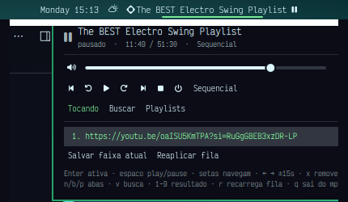

# YouTube Radio — plugin do Omarchy

Toca **apenas o áudio** de vídeos, lives e playlists do YouTube pelo `mpv` +
`yt-dlp`, com chip na barra, popup de controles, busca, playlists locais que
sobrevivem a reinícios e retomada de posição por URL. Não abre navegador e não
carrega vídeo. É uma ferramenta pessoal: fila plana, sem tags nem smart
playlists.



## Requisitos

| Dependência | Uso | Obrigatória |
|---|---|---|
| `mpv` | reprodução (áudio apenas, via IPC JSON) | sim |
| `yt-dlp` | busca (`ytsearch`) e resolução de stream | sim |
| Quickshell/Omarchy (shell Quattro) | widgets, painel, IPC | sim |
| `socat`, `jq`, `curl` | apenas para os scripts de teste/diagnóstico | não |

Nada de Python, Node ou runtimes extras em tempo de uso.

## Instalação

```bash
omarchy plugin add https://github.com/WalcimarZD/omarchy-youtube-radio --enable
```

Ou, para desenvolvimento local (de dentro do checkout):

```bash
cp -r . ~/.config/omarchy/plugins/youtube-radio
omarchy-shell shell rescanPlugins
omarchy plugin enable youtube-radio --section center --after omarchy.weather
```

A posição é livre: a barra aceita o widget em qualquer seção. Para movê-lo
depois (sem editar `shell.json` à mão):

```bash
omarchy bar move youtube-radio --section center --after omarchy.weather
omarchy bar move youtube-radio --section right --after omarchy.tray
omarchy bar move youtube-radio --section left  --index 0
```

A mudança recarrega na hora (o shell observa `shell.json`).

Atalho recomendado (`~/.config/hypr/bindings.lua`):

```lua
o.bind("SUPER + R", "YouTube Radio", "omarchy-shell youtube-radio toggle")
```

Depois de editar qualquer arquivo do plugin que **já estava carregado**, reinicie
o shell: `omarchy restart shell`. O `rescanPlugins` recria os objetos, mas o
Quickshell 0.3.1 não expõe `Qt.clearComponentCache`, então o mesmo caminho de
arquivo continua servindo o componente compilado antigo. Plugin novo (URL nova)
carrega normalmente só com o rescan.

## Uso

- **Clique esquerdo** no chip: play/pause.
- **Clique direito**: abre o popup.
- **Clique do meio**: próxima faixa.
- **Scroll**: volume.
- Título longo é truncado (`barTitleMaxChars`) e o tooltip mostra tudo: título,
  estado, tempo, playlist, item, modo e último erro.

### Popup

- Cabeçalho com título, estado (tocando/pausado/parado/ao vivo), tempo e volume.
- Transporte: anterior, −15s, play/pause, +15s, próxima, parar, sair do mpv e o
  chip de modo (sequencial → repetir faixa → repetir playlist → aleatório).
- Aba **Tocando**: fila atual, item em reprodução destacado, subir/descer/remover
  (quando a fila veio de uma playlist), "Salvar faixa atual" e "Reaplicar fila".
- Aba **Buscar**: um campo para colar URL (toca direto) ou digitar um termo
  (lista resultados do `yt-dlp` para escolher por clique ou número). A lista é
  numerada de 1 a `maxResults` (padrão 10): `1`–`9` tocam aquele resultado
  direto e `↑`/`↓` + `⏎` (ou clique) alcançam qualquer um, inclusive acima de 9.
- Aba **Playlists**: criar, tocar, renomear, apagar (com confirmação em dois
  cliques), expandir para editar itens e "Salvar faixa atual aqui".

### Teclado

| Tecla | Ação |
|---|---|
| `⏎` | ativa o item selecionado (toca a faixa/resultado/playlist) |
| `espaço` | play/pause |
| `↑` `↓` (`k` `j`) | navega na lista da aba atual |
| `←` `→` (`h` `l`) | −15s / +15s |
| `x` | remove o item selecionado / apaga a playlist (2×) |
| `m` | cicla o modo de reprodução |
| `n` `b` `p` | abas Tocando / Buscar / Playlists |
| `v` | foca o campo de busca |
| `1`–`9` | toca o resultado N (aba Buscar) |
| `R` | renomeia a playlist selecionada (aba Playlists) |
| `r` | recarrega a fila a partir da playlist salva |
| `q` | sai do mpv (libera memória) |
| `Tab` | passa para o próximo painel da barra |
| `esc` | fecha o popup |

### Menu do Omarchy

Entradas sugeridas em `~/.config/omarchy/extensions/omarchy-menu.jsonc`:

```jsonc
"radio": {"icon":"", "label":"YouTube Radio"},
"radio.toggle":    {"label":"Play/pause",        "action":"omarchy-shell youtube-radio playPause"},
"radio.open":      {"label":"Abrir controles",   "action":"omarchy-shell youtube-radio toggle"},
"radio.playlists": {"label":"Tocar playlist...", "action":"omarchy-shell youtube-radio promptPlaylists"},
"radio.search":    {"label":"Buscar...",         "action":"omarchy-shell youtube-radio promptSearch"},
"radio.current":   {"label":"Retomar playlist atual", "action":"omarchy-shell youtube-radio playCurrent"},
"radio.next":      {"label":"Próxima faixa",     "action":"omarchy-shell youtube-radio next"},
"radio.stop":      {"label":"Parar",             "action":"omarchy-shell youtube-radio stop"},
"radio.quit":      {"label":"Sair do mpv",       "action":"omarchy-shell youtube-radio quitPlayer"}
```

### IPC

Alvo `youtube-radio` (vive no service, instância única):

```
omarchy-shell youtube-radio toggle|open|close|isOpen
omarchy-shell youtube-radio playPause|play|stop|next|previous
omarchy-shell youtube-radio seekForward|seekBackward|volume <delta>
omarchy-shell youtube-radio playUrl <url>|playSearch <termo>|playInput <url-ou-termo>
omarchy-shell youtube-radio search <termo>|playResult <n>|playQueueIndex <n>
omarchy-shell youtube-radio playPlaylist <id>|playCurrent|reloadQueue
omarchy-shell youtube-radio setMode <sequencial|repeat-one|repeat-all|shuffle>|cycleMode
omarchy-shell youtube-radio createPlaylist <nome>|renamePlaylist <id> <nome>
omarchy-shell youtube-radio deletePlaylist <id>|addPlaylistItem <id> <url-ou-termo>
omarchy-shell youtube-radio addCurrentToPlaylist <id>|removePlaylistItem <id> <n>
omarchy-shell youtube-radio movePlaylistItem <id> <n> <delta>
omarchy-shell youtube-radio status|queueJson|playlistsJson|searchJson|selfTest
```

## Configuração

Ajustável pelo painel de configurações de widgets do Omarchy (`shell.json`,
entrada do widget):

| Chave | Padrão | Descrição |
|---|---|---|
| `socketPath` | vazio | vazio usa `$XDG_RUNTIME_DIR/youtube-radio/mpv.sock` (ou `/tmp/...`) |
| `maxResults` | 10 | resultados por busca (schema: 1–25; o painel de settings respeita o limite, `omarchy bar set` não valida) |
| `idleQuitMinutes` | 30 | sai do mpv após N minutos ocioso (0 = nunca) |
| `stallTimeoutSeconds` | 120 | live sem avanço por N s → pula de faixa (0 = desliga) |
| `resumeMinSeconds` | 30 | posição mínima para valer retomada |
| `barTitleMaxChars` | 42 | truncamento do título na barra |
| `showTimeInBar` | false | mostra `mm:ss` no chip |
| `ytdlFormat` | `bestaudio/best` | repassado ao mpv como `--ytdl-format` |
| `defaultVolume` | 80 | volume inicial quando não há estado salvo |
| `extraMpvArgs` | vazio | argumentos extras (separados por espaço, sem shell) |

## Dados em disco

```
~/.local/share/youtube-radio/
  playlists.json   {version, playlists:[{id,name,mode,updated,items:[{kind,value}]}]}
  state.json       {version, currentPlaylist, mode, volume, positions:{url:{pos,updated}}}
  status.json      retrato do estado atual (diagnóstico; atualizado ~1x/s)
$XDG_RUNTIME_DIR/youtube-radio/
  mpv.sock         soquete IPC do mpv
  queue.m3u        fila enviada ao mpv (loadlist)
  queue.json       espelho legível da fila (rótulos + URLs resolvidas)
```

`kind` é `url` (URL do YouTube) ou `search` (termo resolvido no momento de
tocar, pegando o primeiro resultado). Arquivo de playlists inválido nunca é
sobrescrito: ele é marcado como quebrado, o popup mostra o erro e as edições
ficam bloqueadas até você corrigir ou remover o arquivo. `positions` guarda no
máximo 200 URLs (as mais antigas saem).

## Arquitetura

```
Service.qml (kind: service, instância única)
  MpvIpc.qml ── socket Unix ──> mpv --idle --no-video --input-ipc-server=...
  observe_property: media-title, pause, time-pos, duration, volume, idle-active,
    playlist-pos, playlist-count, playlist-playing-pos, seekable, eof-reached,
    path, mute
  dono da fila, das playlists, das posições e do IPC (alvo youtube-radio)
BarWidget.qml (kind: bar-widget, 1 por monitor)
  Panel + WidgetButton (chip) + KeyboardPanel (popup) + abas em ui/
  fachada: lê o Service por bar.shell.serviceFor("youtube-radio")
```

- O mpv é lançado com `setsid --fork`, então **sobrevive ao reload do shell**; ao
  subir, o service adota o processo vivo (`pgrep`), reconecta no soquete e
  **repõe a fila do popup** a partir de `queue.json` (a reprodução continua de
  onde estava, sem interrupção).
- A **fila é a playlist nativa do mpv** (`loadlist`/`playlist-next`/`loop-*`); o
  plugin é dono do conteúdo e o mpv do estado da reprodução.
- Modos: `sequential` (`loop-file=no`, `loop-playlist=no`), `repeat-one`
  (`loop-file=inf`), `repeat-all` (`loop-playlist=inf`), `shuffle` (ordem
  embaralhada na fila + `loop-playlist=inf`).
- Live encerrada ou com erro: `end-file`/EOF → mpv avança sozinho; erro de item
  registra o motivo e pula. Live travada (sem `time-pos` avançando) é detectada
  pelo watchdog e também pula.
- Retomada: só quando `seekable` e `duration` finitos e a posição salva está
  entre `resumeMinSeconds` e `duration − 15s` (`set_property time-pos` após
  `file-loaded`). Live nunca retoma; ela volta ao vivo.
- Sem `socat`/`nc` em tempo de execução: o IPC JSON é falado por
  `Quickshell.Io.Socket` + `SplitParser` direto do QML.

### Notas de implementação

- **`Quickshell.Io.Socket` (0.3.1) não se recupera de uma conexão falha.**
  Depois de uma tentativa que falha, `connected = true` vira no-op, porque o
  `QLocalSocket` interno só é liberado no caminho de *disconnect* — que nunca
  acontece se a conexão jamais foi estabelecida. `MpvIpc.qml` contorna isso
  destruindo e recriando o objeto a cada falha (com backoff) e escrevendo
  sempre no objeto que de fato conectou. Esse mesmo mecanismo cobre "mpv ainda
  subindo" e a queda do processo no meio da reprodução.
- **Editar o plugin já carregado exige `omarchy restart shell`.** O
  `omarchy-shell shell rescanPlugins` recria os objetos, mas o Quickshell não
  limpa o cache de componentes (`Qt.clearComponentCache` não existe nesta
  versão), então o mesmo caminho de arquivo continua servindo o código
  compilado anterior. Instalar um plugin novo funciona só com o rescan.
- O mpv é lançado por `Util.execArgv` + `setsid --fork`, e o service o adota no
  próximo start via `pgrep -f input-ipc-server=<soquete>`.

## Limitações conhecidas

- **Playlist do YouTube como item**: o `yt-dlp` expande dentro do mpv, então a
  fila do mpv fica maior que a lista do plugin. O popup avisa ("playlist do
  YouTube expandida") e desabilita reordenar/remover naquela fila; modos e
  avanço continuam funcionando.
- **Dois monitores**: `SUPER+R` e o menu abrem o popup no **monitor focado**; o
  clique no chip abre no monitor do clique. Só uma instância registra o alvo IPC
  (por isso ele vive no service).
- **`mpv-mpris`**: se estiver instalado (`/etc/mpv/scripts/mpris.so`), o mpv
  aparece também como player MPRIS — as teclas de mídia do Omarchy passam a
  controlá-lo. Não é dependência nem conflito: o IPC do plugin continua dono.
- Sem `$XDG_RUNTIME_DIR` o soquete cai para `/tmp/youtube-radio/`.
- Não há download de mídia, suporte a vídeo, tags, smart playlists, nem fontes
  que não sejam YouTube.

## Desenvolvimento e verificação

```bash
tests/model-test.mjs      # lógica pura (Model.js) — dev-only, precisa de node
tests/tst_model.qml       # mesma bateria dentro de um runtime QML
tests/mpv-ipc-check.sh    # valida comandos/propriedades/eventos no mpv real (--ao=null)
tests/live-check.sh       # aceitação ao vivo contra o shell rodando (toca áudio)
omarchy plugin validate . # validação do manifest (sem symlinks, entry points ok)
omarchy-shell youtube-radio selfTest   # roda as asserções dentro do shell
```

`tests/live-check.sh` exige o plugin instalado e habilitado, e usa `omarchy-shell`,
`socat` e `jq`. Ele cria e apaga uma playlist de teste e encerra o mpv ao final.

## Licença

MIT — veja [LICENSE](LICENSE).
